# Customizable form system

One key feature of our application is that it allows users to create their own forms and attach those forms to entities like customers, daily visits, products etc. The app also allows the user to perform analytics and data reporting using the custom data. This document will discuss a few ways to implement custom fields in our system.

## Components of the system

There are three components to the system.

1. The template schema
2. Forms
3. Responses

### The template schema

The template schema is a json schema managed by the Konomi.ai team. This schema defines the possible shape of tenant forms. The schema includes all allowed field types, field properties and form structure information.

The template is in the shape of a json schema version 7

### Forms

Forms are created by tenants and used within the tenancy. The shape of the forms are governed by the template schema. All forms must pass a schema test before responses can be made to the form.

The form shape is sanctioned by the template schema, upon saving a form, a new json schema will be generated to validate form responses.

### Responses

Responses are created by tenants's staff and are associated with a particular version of a form version. The response must pass a schema test before it can be used.

## Form Features

### Validation

Every response is validated against the version of the form it is responding to, this ensures that all fields are valid before the user can save a response. Response validation happens on the client first and then on the server. The validation logic is handled by the `c-form` package which includes helper function that take in a form definition and validate against it.

Currently, we aim to support optional fields first. In the future we want to support more complex field validation logic.

### Versioning

A core design of the form is the ability to keep track of versions for forms and responses. When a change is made to a form/response, a new version of the entity will be created, this will ensure a full track of audit history on changes and allow the ability to rollback potential changes. This also keeps the database sain for the sake of the developers.

### Field types

The form will support the following form types for now:

1. Short text - usually text within one line
2. Long text - text that can span multiple paragraphs
3. Multiple choice - select an option from a list of possible options
4. Multi select - select up to a number of options from a list of possible options
5. Number - an input that can only be a numerical value (no scientific values allowed)

### Load multiple choice options from server

The system will be able to load multiple choice options dynamically using REST APIs.

### Connection with entities

Entities like activity entry, customers, etc. will have a new responses field. This will keep track of all the responses that was filled for the entity.

For activity entry, upon creation, all forms with activity entry as the purpose is loaded. The user selects one form and completes it. Then users can add any number of activity entry, or null purpose forms to the entry.

For all other entities, by default all forms whose purpose is matching the entity are required to be completed. Then users can attach any additional fields.

## Form management lifecycle

### Create new form

### Update existing form

## Database design

Here we describe the proposed database design for this system

```mermaid
erDiagram
  form ||--|| latestForm  : uses
  form ||--|{ formVersion : versions
  form {
    string id
    string templateVersion
    string purpose
  }
  formVersion ||--o| latestForm : is
  formVersion {
    string id
    string formVersionId
    json formData
  }
  response |o--|| formVersion : responsesTo
  response ||--|| latestResponse : uses
  response ||--|{ responseVersion : versions
  response {
    string id
  }
  responseVersion ||--o| latestResponse : is
  responseVersion {
    string id
    json responseData
  }
```

