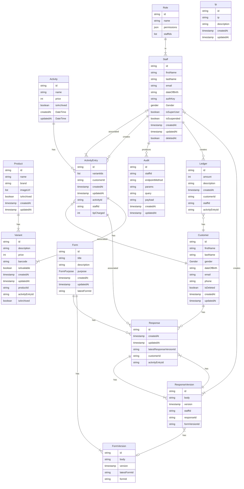

# Database Design

```mermaid
erDiagram
    Activity {
        string id
        string name
        int price
        boolean isArchived
        createdAt DateTime
        updatedAt DateTime
    }
    Role {
        string id
        string name
        json permissions
        list staffIds
    }
    Staff {
        string id
        string firstName
        string lastName
        string email
        string dateOfBirth
        string authKey
        gender Gender
        boolean isSuperUser
        boolean isSuspended
        timestamp createdAt
        timestamp updatedAt
        boolean deletedAt
    }
    Variant {
        string id
        string description
        int price
        string barcode
        boolean isAvailable
        timestamp createdAt
        timestamp updatedAt
        string productId
        string activityEntryId
        boolean isArchived
    }
    Product {
        string id
        string name
        string brand
        list imageUrl
        boolean isArchived
        timestamp createdAt
        timestamp updatedAt
    }
    Ip {
        string id
        string ip
        string description
        timestamp createdAt
        timestamp updatedAt
    }
    Form {
        string id
        string title
        string description
        FormPurpose purpose
        timestamp createdAt
        timestamp updatedAt
        string latestFormId
    }
    FormVersion {
        string id
        string body
        timestamp version
        string latestFormId
        string formId
    }
    Response {
        string id
        timestamp createdAt
        timestamp updatedAt
        string latestResponseVersionId
        string customerId
        string activityEntryId
    }
    ResponseVersion {
        string id
        string body
        timestamp version
        string staffId
        string responseId
        string formVersionId
    }
    Customer {
        string id
        string firstName
        string lastName
        Gender gender
        string dateOfBirth
        string email
        string phone
        boolean isDeleted
        timestamp createdAt
        timestamp updatedAt
    }
    ActivityEntry {
        string id
        list variantIds
        string customerId
        timestamp createdAt
        timestamp updatedAt
        string activityId
        string staffId
        int tipCharged
    }
    Ledger {
        string id
        int amount
        string description
        timestamp createdAt
        string customerId
        string staffId
        string activityEntryId
    }
    Audit {
        string id
        string staffId
        string endpointMethod
        string params
        string query
        string payload
        timestamp createdAt
        timestamp updatedAt
    }

    Role ||--|{ Staff: in
    Staff |o--|{ ActivityEntry: associated
    ActivityEntry }o--|| Customer: associated
    Form ||--o{ Response: has
    Activity ||--o{ ActivityEntry: has
    Staff ||--o{ ActivityEntry: creates
    Staff ||--o{ Audit: produces
    Staff ||--o{ Ledger: creates
    Staff }|--|{ ResponseVersion: creates
    Product ||--|{ Variant: has
    Form ||--|{ FormVersion: has
    Response ||--|{ ResponseVersion: has
    Customer ||--o{ Response: has
    ResponseVersion }|--|o FormVersion: has
    ResponseVersion ||--|{ Response: has
    Ledger }o--|| Customer: has
    ActivityEntry ||--o{ Response: associated
    ActivityEntry ||--|{ Variant: has
```
