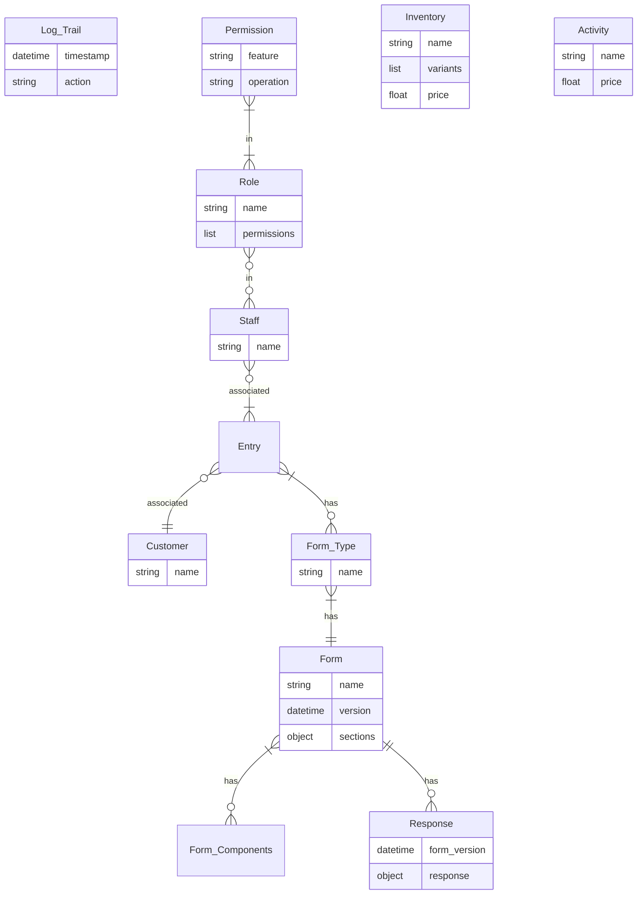

# Database Design

```mermaid
erDiagram
    
    Log_Trail {
        datetime timestamp
        string action
    }
    Permission {
        string feature
        string operation
    }
    Role {
        string name
        list permissions
    }
    Staff {
        string name
    }
    Entry {}
    Customer {
        string name
    }
    Form_Type{
        string name
    }
    Form {
        string name
        datetime version
        object sections
    }
    Response {
        datetime form_version
        object response
    }
    Form_Components {}
    Inventory {
        string name
        list variants
        float price
    }
    Activity {
        string name
        float price
    }

    Permission }|--|{ Role: in
    Role }o--o{ Staff: in
    Staff }o--|{ Entry: associated
    Entry }o--|| Customer: associated
    Entry }|--o{ Form_Type: has
    Form_Type }|--|| Form: has
    Form }|--o{ Form_Components: has
    Form ||--o{ Response: has
```