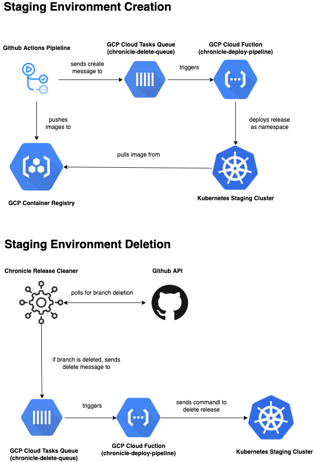

# Chronicle Staging Environment

## High Level Diagram

## Overview
1. Github Actions will be used to trigger the workflow for the entire deployment process. It will send a deploy queue entry to a `GCP Cloud Tasks` queue, let’s call it the `deploy-queue` with the necessary metadata for the deploy (docker image tag, git branch, etc). Therefore, we will need a docker registry to maintain the necessary images for the staging instance, we will also have to create a system to remove unused images to reduce cost. We will use the `gcloud`  cli to push to the docker registry. Essentially, this Github Actions step will occur after every push to the branch, that way a new environment will essentially be created for that branch on every push.
* `Environment Cleaner` is a service that will be running on the cloud to asynchronously detect branch releases by polling the GitHub API. If a current environment for `branch_1` is still running,  but ` branch_1` is deleted, this service will handle the cleanup. 
	* If a branch is deleted,  a destroy request to a  `GCP Cloud Tasks` queue, let’s call it the `destroy-queue` . The `destroy-queue` entry will then be read by a  `GCP Cloud Function` that handles the creation of the environment itself.  
        * The reasoning behind this multilayer process is that the `GCP Cloud Function` may have easier access to the core credentials via `GCP Secret Manager`  required perform all the necessary installations and deployments. If we can easily inject credentials into the `Environment Cleaner` itself, this step is no longer necessary. 
* Create `deployment.yaml` file and template it for each specific branch. This `deployment.yaml` will the the manifest to deploy each chronicle application to a kubernetes cluster.

## Kubernetes
* [Deploying a Containerized Web Application  |  Kubernetes Engine  |  Google Cloud](https://cloud.google.com/kubernetes-engine/docs/tutorials/hello-app)
* [Deploying An Application On Kubernetes From A to Z](https://www.magalix.com/blog/deploying-an-application-on-kubernetes-from-a-to-z)
* Due to the dilemma of getting a database running on a staging environment, the solution may be to host the staging environments on a simple Kubernetes cluster. This may prove to be beneficial in the long run as we can set up controllers  like [external-dns](https://github.com/kubernetes-sigs/external-dns) to perform exclusive tasks like makes our staging deployments easily discoverable via public DNS servers.  Deploying to a Kubernetes environment would let us spin up a local mongoDB instance bound to the cluster namespace itself (where the web application + server  would also exist), which would eliminate the need to spin up a [GCP MondogDb Atlas](https://cloud.google.com/mongodb) instance every time a new branch is created
* There would be 2-3 Kubernetes clusters: staging, production and tooling.  The tooling cluster is for now optional, but it would be a flexible cluster that could be used to install external applications unrelated to Chronicle, but could help potential be useful for our workflow. 

## Terraform
* We will terraform all our core cloud infrastructure so everything can easy be spun up in the click of a button. Examples of services: Atlas (our production database),  Cloud Tasks (queues for our staging environment workflow), GKE (how we would be hosting our Kubernetes cluster), Cloud Functions (function-as-a-service that will be used for our staging environments), Cloud Storage (to store our terraform state)
* Might be overkill but if within scope, consider using [Atlantis](https://www.runatlantis.io/) (which would deployed as a Kubernetes controller) to run all of our future Terraform changes, it’s a nice way to persist import terraform output variables directory as GitHub commit messages for future reference. This service could be run in our tools kubernetes cluster

